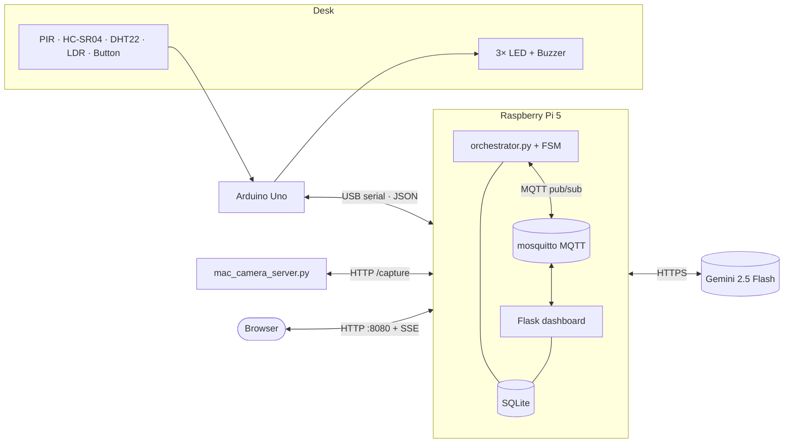

# Lock-In

> SIT210 — Embedded Systems Development. Watches my desk, judges focus using
> Gemini, runs a deterministic state machine on a Raspberry Pi 5.

A button-driven focus tracker. The Pi orchestrates an Arduino Uno sensor
frontend over USB serial and a Mac webcam HTTP server over WiFi. Every 60–90
seconds it captures a still from the camera and asks Gemini whether the person
looks focused. The judgment is one input into a five-state FSM that owns all
the actual decisions — the model is a sensor, not an oracle.

## Documentation map

| File                                  | Contents                                          |
|---------------------------------------|---------------------------------------------------|
| [`docs/architecture.md`](docs/architecture.md) | Block diagrams, async task layout, vision sequence, ER diagram |
| [`docs/fsm.md`](docs/fsm.md)          | State diagram, hysteresis table, action catalogue |
| [`docs/circuit.md`](docs/circuit.md)  | Pin map, schematic, wiring details                |
| [`docs/setup.md`](docs/setup.md)      | End-to-end install + run instructions             |

## High-level architecture



Three communication protocols are in play: **UART** (Arduino↔Pi, 115200 baud
JSON), **HTTP/HTTPS** (Pi↔Mac webcam, Pi↔Gemini, browser↔dashboard), and
**MQTT** (orchestrator↔dashboard via a local mosquitto broker). The dashboard
pushes state to the browser over **Server-Sent Events**, so the UI reflects a
state change in well under a second instead of waiting for a poll.

## Repository layout

```
arduino/lock_in_arduino/   - Arduino Uno firmware (sensors + buzzer + button + LEDs)
arduino/lock_in_demo/      - peripheral sanity-check sketch
mac_camera/                    - Mac webcam HTTP server (drop-in camera source)
pi/                            - Python orchestrator + Flask dashboard
  config.py                    - env-driven config + derived paths
  database.py                  - SQLite schema and helpers
  serial_reader.py             - async Arduino bridge
  camera_client.py             - async camera client (HTTP /capture endpoint)
  vision_judge.py              - Gemini multimodal judge
  fsm.py                       - finite state machine (pure logic)
  mqtt_bus.py                  - async MQTT pub/sub (orchestrator side)
  sd_notify.py                 - systemd watchdog/ready notifier (no deps)
  orchestrator.py              - wires everything together
  main.py                      - entry point
  run.sh                       - launch orchestrator + dashboard together
  dashboard/                   - Flask app + Jinja templates + CSS
    mqtt_bridge.py             - MQTT subscriber + SSE fan-out (dashboard side)
  systemd/                     - service unit files
  test_fsm.py                  - FSM smoke tests (no hardware)
  test_vision_judge.py         - Gemini JSON parser tests
  test_serial_reader.py        - serial reconnect / overflow tests
  test_mqtt_integration.py     - live MQTT round-trip tests
docs/                          - architecture, FSM, circuit, setup
```

## How it works (one paragraph)

The Arduino streams a 1 Hz JSON sensor frame (PIR, ultrasonic, DHT22, LDR) over
USB serial, and pushes button events (single / double / long press) and PIR
triggers as they happen. The Mac webcam server serves a fresh JPEG on
`/capture` whenever the Pi asks. The Pi's `orchestrator.py` runs eight asyncio
tasks — serial reader, serial consumer, FSM tick loop, vision loop, image
retention, MQTT bus, snapshot publisher, and systemd watchdog — that all
share a single `FocusFsm` instance. The FSM owns transitions between
`AWAY → IDLE → FOCUS → DEGRADING → BREAK` with hysteresis on every edge. A
separate Flask app serves a small dashboard from the same SQLite database; it
subscribes to the orchestrator's MQTT snapshot topic and pushes updates to the
browser over Server-Sent Events. If the broker is down, both sides fall back
to the on-disk `snapshot.json` / `cmd.json` files, so the dashboard keeps
working.

## Quick start (on the Pi)

```bash
git clone <this repo> ~/lock-in
cd ~/lock-in/pi
python3 -m venv .venv
source .venv/bin/activate
pip install -r requirements.txt

# MQTT broker (orchestrator ↔ dashboard transport)
sudo apt install -y mosquitto mosquitto-clients
sudo systemctl enable --now mosquitto

cp .env.example .env
# fill in GEMINI_API_KEY and the camera URL
$EDITOR .env

# smoke-test everything that needs no hardware
python -m unittest discover -p 'test_*.py'

# run orchestrator + dashboard together
./run.sh
```

Open `http://<pi-ip>:8080/` for the dashboard.

To install as services:

```bash
sudo cp systemd/lockin-*.service /etc/systemd/system/
sudo systemctl daemon-reload
sudo systemctl enable --now lockin-orchestrator lockin-dashboard
sudo journalctl -fu lockin-orchestrator
```

## Hardware wiring (Arduino Uno)

| Component   | Pin               | Notes                                       |
|-------------|-------------------|---------------------------------------------|
| PIR         | D2                | INT0 hardware interrupt                     |
| Button      | D3                | INT1, `INPUT_PULLUP`, active-low            |
| Ultrasonic  | D4 trig / D5 echo | HC-SR04                                     |
| LED red     | D6                | 220 Ω in series                             |
| DHT22       | D7                | with 10 kΩ pull-up to VCC                   |
| LED yellow  | D8                | 220 Ω in series                             |
| Buzzer      | D9                | PWM via `tone()`                            |
| LED green   | D10               | 220 Ω in series                             |
| LDR         | A0                | voltage divider with 10 kΩ to GND           |

Arduino runs at 115200 baud, newline-delimited JSON. See
[`docs/circuit.md`](docs/circuit.md) for the full block diagram and
[`docs/setup.md`](docs/setup.md) for end-to-end install instructions.

## Why Gemini instead of a local model

The original plan used Ollama + Moondream2. The project switched to Gemini for
two reasons:

1. The Gemini API removes the heaviest local workload (vision inference)
   from the Pi, leaving headroom for the orchestrator, dashboard, and
   future expansion.
2. The same architecture still treats the model as a sensor, not an
   oracle — the FSM enforces all timing and safety, and Gemini failure
   (rate limit, timeout, invalid JSON) is handled as a no-op cycle exactly
   like a local model would be.

Everything else still runs locally on the Pi.

## Fault tolerance

All five failure paths from the project plan are implemented:

| Failure                         | Detection                       | Degradation                                  |
|---------------------------------|---------------------------------|----------------------------------------------|
| Arduino disconnects             | serial readline EOF             | reconnect loop every 5 s; FSM holds state    |
| Camera unreachable              | HTTP timeout / connection error | skip vision cycle; sensor logic continues    |
| Gemini returns invalid JSON     | parser returns `None`           | discard judgment; log; try again next cycle  |
| Gemini call too slow            | `asyncio.wait_for` timeout      | skip cycle                                   |
| Pi power loss mid-session       | startup sweep marks orphans     | session row marked incomplete; no data loss  |
| MQTT broker down                | publish/connect failure         | fall back to `snapshot.json` / `cmd.json`    |
| Orchestrator hangs (deadlock)   | systemd watchdog (missed feeds) | killed + restarted after 120 s               |

systemd `Restart=always` plus a real `Type=notify` watchdog (`WATCHDOG=1` fed
every 30 s, `WatchdogSec=120`) on the orchestrator catches both crashes and
silent hangs.

## Tests

```bash
cd pi
python -m unittest discover -p 'test_*.py'
```

| Suite                       | Coverage                                                      |
|-----------------------------|--------------------------------------------------------------|
| `test_fsm.py`               | Every FSM transition, hysteresis hold, button gesture (13)   |
| `test_vision_judge.py`      | Gemini JSON parser: fences, prose, truncation, bad types (25)|
| `test_serial_reader.py`     | Auto-reconnect on EOF, queue-overflow drop, parse errors (9) |
| `test_mqtt_integration.py`  | Live pub/sub round-trip orchestrator↔dashboard (4)*          |

*Integration tests skip automatically if no broker is on `127.0.0.1:1883`.
None of the suites need hardware. See [`docs/fsm.md`](docs/fsm.md) for the full
state diagram.
