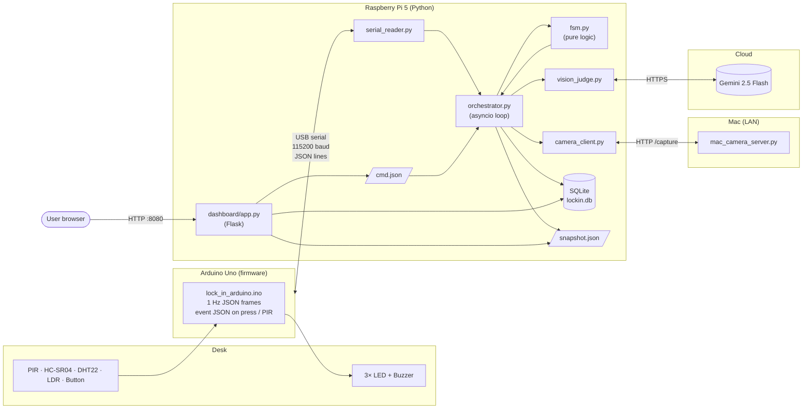
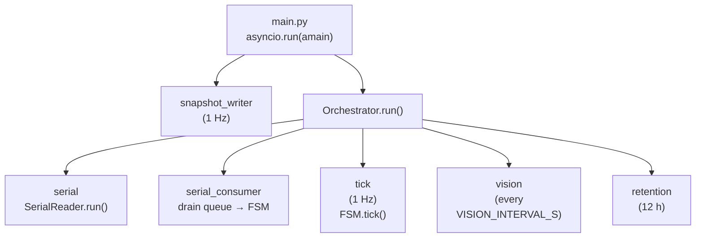
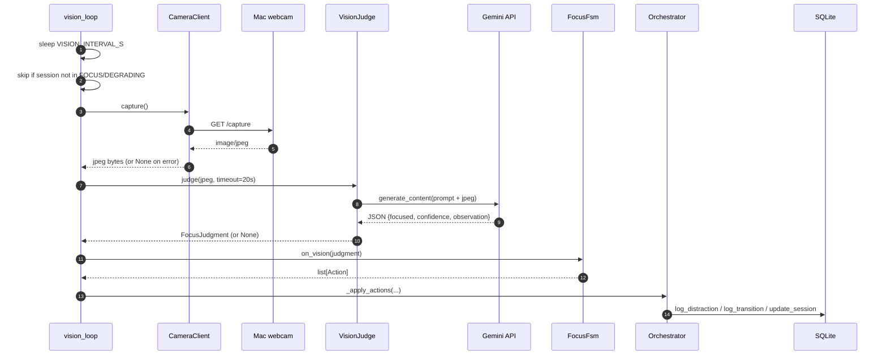
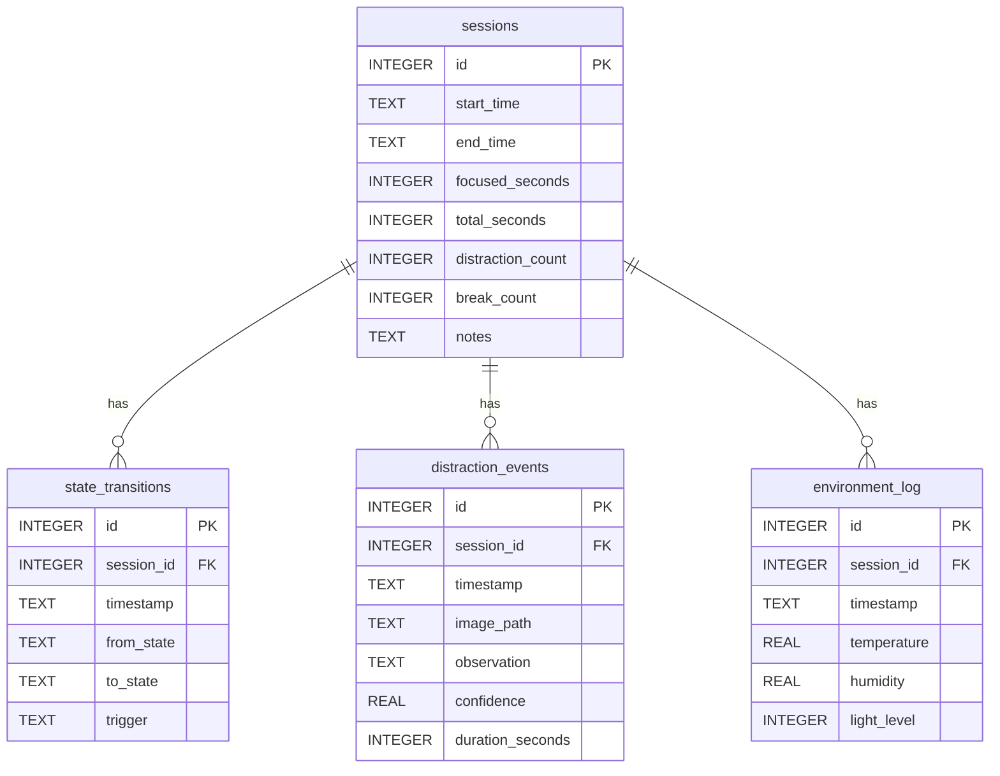

# Architecture

This doc explains how Lock-In is wired together at the software level.
For the physical wiring see [`circuit.md`](circuit.md); for the state machine
see [`fsm.md`](fsm.md).

## 1. System overview

Three independent processes, three transports, one source of truth (the FSM).

Key points:

- **One FSM, many inputs.** Serial frames, vision judgments, button events,
  and dashboard commands all funnel into a single `FocusFsm` instance. Nothing
  else owns state.
- **Files as IPC.** The orchestrator writes `snapshot.json` once per second;
  the dashboard reads it. The dashboard writes `cmd.json` to request
  state changes; the orchestrator drains it. No shared memory, no socket.
- **Vision is a sensor, not an oracle.** A failed Gemini call (timeout,
  bad JSON, network) is a no-op for the cycle. The FSM still ticks.

## 2. Async task topology (on the Pi)

Tasks are started with `asyncio.create_task` and awaited together with
`asyncio.wait(..., return_when=FIRST_EXCEPTION)`. If any one task crashes,
the others get cancelled, the loop unwinds, and systemd restarts the process.

## 3. Vision cycle sequence

Any None response between steps 5 and 9 short-circuits the cycle — the
sensor-only paths in `FSM.tick()` continue regardless.

## 4. Data model

`sessions.id` is the foreign key everywhere. Sessions left open on a crash
are sealed at next startup by `mark_orphan_sessions_incomplete` and tagged
in their `notes` column.

## 5. Network ports and protocols

| Port | Process            | Role                                    |
|------|--------------------|-----------------------------------------|
| 8080 | dashboard (Pi)     | HTTP — Flask dashboard + JSON APIs      |
| 8081 | mac_camera_server  | HTTP — `/capture` returns image/jpeg    |
| USB  | Arduino ↔ Pi       | 115200 baud, newline-delimited JSON     |
| 443  | Pi → Gemini        | HTTPS — `generativelanguage.googleapis.com` |

## 6. Module map (Pi)

| Module             | Responsibility                                                       |
|--------------------|----------------------------------------------------------------------|
| `config.py`        | Load env vars into a frozen `Config` dataclass; derive paths.        |
| `database.py`      | SQLite wrapper, schema, all queries. Thread-safe via single lock.    |
| `serial_reader.py` | Async serial reader/writer with auto-reconnect on EOF.               |
| `camera_client.py` | Async HTTP client for `/capture`.                                    |
| `vision_judge.py`  | Gemini call + strict JSON parser.                                    |
| `fsm.py`           | `FocusFsm` — pure state machine, no I/O.                             |
| `orchestrator.py`  | Wires all of the above into asyncio tasks; owns the FSM instance.    |
| `main.py`          | Entry point. Sets up logging, signals, snapshot writer.              |
| `dashboard/app.py` | Flask — read-only over `snapshot.json` + SQLite; writes `cmd.json`.  |

Every I/O module degrades gracefully: a missing dependency or a network
fault logs once and returns `None` / `False`. The FSM never crashes the
orchestrator; the orchestrator never crashes systemd's restart loop.
