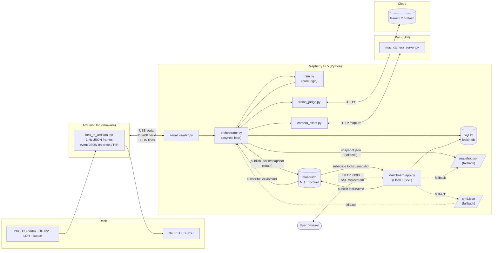
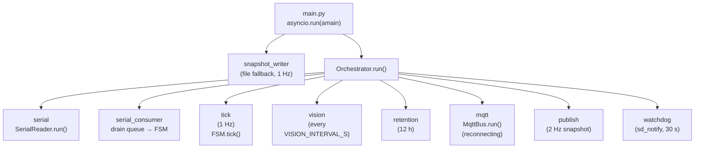
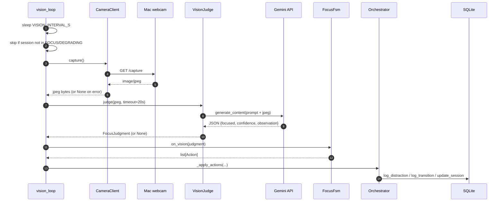
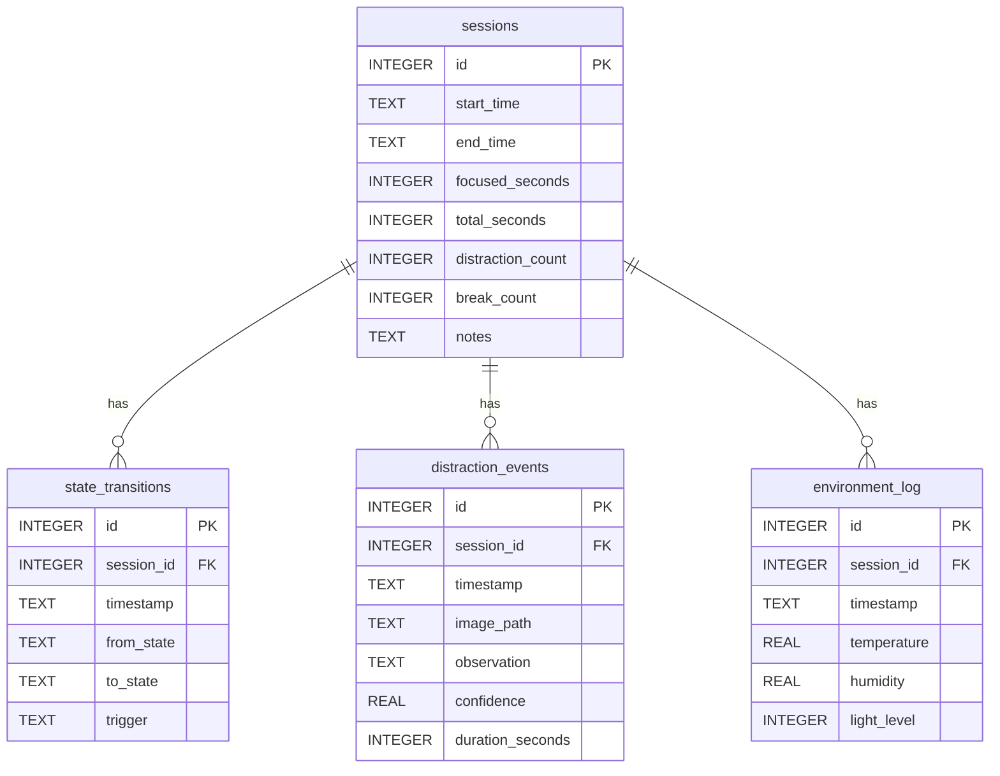

# Architecture

This doc explains how Lock-In is wired together at the software level.
For the physical wiring see [`circuit.md`](circuit.md); for the state machine
see [`fsm.md`](fsm.md).

## 1. System overview

Three independent processes, three transports, one source of truth (the FSM).

Key points:

- **One FSM, many inputs.** Serial frames, vision judgments, button events,
  and dashboard commands all funnel into a single `FocusFsm` instance. Nothing
  else owns state.
- **MQTT as primary IPC.** The orchestrator publishes the snapshot to
  `lockin/snapshot` (retained, ~2 Hz) and subscribes to `lockin/cmd`. The
  dashboard mirrors that: subscribes to the snapshot, publishes commands. The
  browser gets pushed updates over Server-Sent Events (`/api/stream`), so a
  state change shows up in well under a second.
- **Files as fallback IPC.** If mosquitto is unreachable, the orchestrator
  still writes `snapshot.json` and still drains `cmd.json`; the dashboard reads
  the file and writes commands to it, and the browser falls back to polling.
  The system degrades from real-time to ~1–2 s latency but never breaks.
- **Vision is a sensor, not an oracle.** A failed Gemini call (timeout,
  bad JSON, network) is a no-op for the cycle. The FSM still ticks.

## 2. Async task topology (on the Pi)

Eight tasks are started with `asyncio.create_task` and awaited together with
`asyncio.wait(..., return_when=FIRST_EXCEPTION)`. If any one task crashes,
the others get cancelled, the loop unwinds, and systemd restarts the process.
The `watchdog` task pings systemd every 30 s; if the whole loop deadlocks the
pings stop and systemd kills + restarts after `WatchdogSec=120`.

## 3. Vision cycle sequence

Any None response between steps 5 and 9 short-circuits the cycle — the
sensor-only paths in `FSM.tick()` continue regardless.

## 4. Data model

`sessions.id` is the foreign key everywhere. Sessions left open on a crash
are sealed at next startup by `mark_orphan_sessions_incomplete` and tagged
in their `notes` column.

## 5. Network ports and protocols

| Port | Process            | Role                                    |
|------|--------------------|-----------------------------------------|
| 8080 | dashboard (Pi)     | HTTP — Flask dashboard + JSON APIs + SSE |
| 8081 | mac_camera_server  | HTTP — `/capture` returns image/jpeg    |
| 1883 | mosquitto (Pi)     | MQTT — `lockin/snapshot`, `lockin/cmd`  |
| USB  | Arduino ↔ Pi       | 115200 baud, newline-delimited JSON     |
| 443  | Pi → Gemini        | HTTPS — `generativelanguage.googleapis.com` |

### MQTT topics

| Topic             | Publisher    | Subscriber   | Payload                          | Retain |
|-------------------|--------------|--------------|----------------------------------|--------|
| `lockin/snapshot` | orchestrator | dashboard    | full snapshot JSON (~2 Hz)       | yes    |
| `lockin/cmd`      | dashboard    | orchestrator | `{type: button\|settings, ...}`  | no     |

`lockin/snapshot` is published **retained** so a dashboard (or page reload)
that connects mid-session immediately receives the current state instead of
waiting for the next publish.

## 6. Module map (Pi)

| Module                    | Responsibility                                                       |
|---------------------------|----------------------------------------------------------------------|
| `config.py`               | Load env vars into a frozen `Config` dataclass; derive paths.        |
| `database.py`             | SQLite wrapper, schema, all queries. Thread-safe via single lock.    |
| `serial_reader.py`        | Async serial reader/writer with auto-reconnect on EOF.               |
| `camera_client.py`        | Async HTTP client for `/capture`.                                    |
| `vision_judge.py`         | Gemini call + strict JSON parser.                                    |
| `fsm.py`                  | `FocusFsm` — pure state machine, no I/O.                             |
| `mqtt_bus.py`             | Async MQTT pub/sub with auto-reconnect; orchestrator's bus.          |
| `sd_notify.py`            | Dependency-free sd_notify client (READY/WATCHDOG/STOPPING).          |
| `orchestrator.py`         | Wires all of the above into asyncio tasks; owns the FSM instance.    |
| `main.py`                 | Entry point. Sets up logging, signals, file-fallback snapshot writer.|
| `dashboard/app.py`        | Flask — MQTT-cached snapshot + SSE stream; publishes commands.       |
| `dashboard/mqtt_bridge.py`| paho-mqtt subscriber thread; caches snapshot, fans out to SSE.       |

Every I/O module degrades gracefully: a missing dependency or a network
fault logs once and returns `None` / `False`. The FSM never crashes the
orchestrator; the orchestrator never crashes systemd's restart loop.
