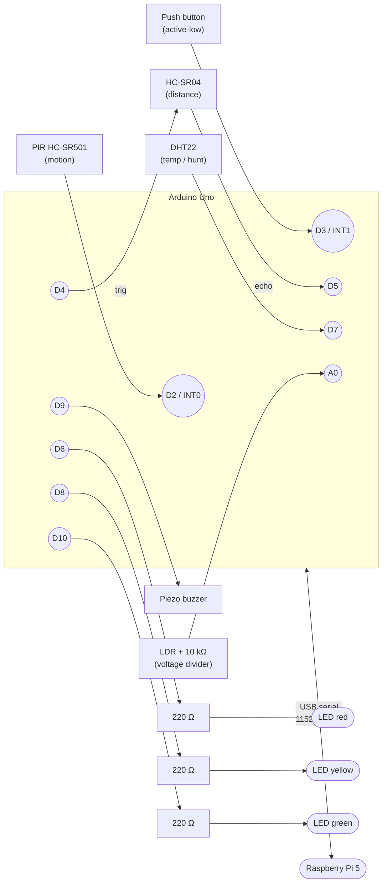

# Circuit and wiring

One circuit:

1. **Arduino Uno** — sensor frontend, button, buzzer, 3× status LED. USB to the Pi.

The Pi has no GPIO wiring of its own; it talks to the Arduino over USB serial.
Camera frames come from `mac_camera_server.py` running on the Mac over WiFi.

---

## 1. Block diagram



---

## 2. Arduino Uno pin map

| Pin   | Direction | Net           | Component        | Notes                            |
|-------|-----------|---------------|------------------|----------------------------------|
| D2    | IN        | PIR_OUT       | HC-SR501 OUT     | INT0, rising edge                |
| D3    | IN        | BTN           | Push button      | INT1, `INPUT_PULLUP`, active-low |
| D4    | OUT       | US_TRIG       | HC-SR04 TRIG     | 10 µs pulse                      |
| D5    | IN        | US_ECHO       | HC-SR04 ECHO     | width = round-trip time          |
| D6    | OUT       | LED_R         | Red LED (+)      | 220 Ω in series to GND           |
| D7    | I/O       | DHT_DATA      | DHT22 DATA       | 10 kΩ pull-up to 5 V             |
| D8    | OUT       | LED_Y         | Yellow LED (+)   | 220 Ω in series to GND           |
| D9    | OUT       | BUZZER        | Piezo buzzer (+) | `tone()` PWM                     |
| D10   | OUT       | LED_G         | Green LED (+)    | 220 Ω in series to GND           |
| A0    | IN        | LDR_ADC       | LDR / 10 kΩ pair | analog 0–1023                    |
| 5V    | —         | VCC_5V        | rail             | PIR, HC-SR04, DHT22, LDR top     |
| GND   | —         | GND           | rail             | common ground                    |

---

## 3. Power and ground rails

```
Arduino 5V  ───┬── PIR VCC
               ├── HC-SR04 VCC
               ├── DHT22 VCC (pin 1)
               ├── DHT_DATA 10 kΩ pull-up
               └── LDR top leg

Arduino GND ───┬── PIR GND
               ├── HC-SR04 GND
               ├── DHT22 GND (pin 4)
               ├── LDR bottom of divider (10 kΩ to GND)
               ├── Button low leg
               ├── LED cathodes (red, yellow, green — via 220 Ω each)
               └── Buzzer (-)
```

---

## 4. ASCII schematic (Arduino + sensors)

```
                                          +5V
                                           │
            ┌────────┐                     │
            │ HC-SR501│                    │
            │ (PIR)   │  VCC ──────────────┤
            │         │  OUT ──── D2  (INT0)
            │         │  GND ─────────── GND
            └────────┘                     │
                                           │
            ┌────────┐                     │
            │ HC-SR04│   VCC ──────────────┤
            │        │   TRIG ── D4
            │        │   ECHO ── D5
            │        │   GND ── GND
            └────────┘                     │
                                           │
                  +5V                      │
                   │                       │
                  10 kΩ pull-up            │
                   │                       │
            ┌──────┴──────┐                │
            │   DHT22     │  VCC ──────────┤
            │             │  DATA ── D7 ───┘ (also through 10 kΩ to +5V)
            │             │  GND  ── GND
            └─────────────┘

                  +5V
                   │
                  LDR
                   │
                   ├────── A0
                   │
                  10 kΩ
                   │
                  GND

            D3 ── (button) ── GND     (INPUT_PULLUP in firmware, no resistor needed;
                                       firmware also rejects bounces < 40 ms)

            D9 ── BUZZER(+)           BUZZER(-) ── GND

            D6 ── 220 Ω ── LED_RED(+)     LED_RED(-)    ── GND
            D8 ── 220 Ω ── LED_YELLOW(+)  LED_YELLOW(-) ── GND
            D10 ── 220 Ω ── LED_GREEN(+)  LED_GREEN(-)  ── GND
```

---

## 5. Critical wiring details

### DHT22

- Use the 4-pin DHT22 (or AM2302 module variant). Pin 1 = VCC, Pin 2 = DATA,
  Pin 3 = NC, Pin 4 = GND.
- A 10 kΩ resistor between DATA and VCC is required. If you have the AM2302
  breakout module, this is already on board — skip the resistor.
- Don't poll it faster than every 2 s. The Arduino firmware caches readings
  at 0.5 Hz and emits them in the 1 Hz frame.

### HC-SR04 (ultrasonic)

- Operates at 5 V. Powering it from 3.3 V will silently fail.
- `pulseIn` in the firmware uses a 25 ms timeout → max ~4 m range, which is
  plenty for desk distance.
- Out-of-range returns `null` in the JSON frame; the FSM treats `null` as
  "away from desk" (no echo means nobody within 4 m of the cone).

### Button (debouncing)

- One leg to D3, one leg to GND. The Arduino's internal pull-up does the
  rest, so no external resistor.
- A 100 nF capacitor across the button legs is optional — the firmware
  already enforces a 40 ms software debounce in the interrupt handler.

### LDR (light dependent resistor)

- A 10 kΩ pull-down with the LDR on top of the divider works well:
  `+5V → LDR → A0 → 10 kΩ → GND`. Brighter light → lower LDR resistance →
  higher voltage on A0 → higher `analogRead()` value.
- Reported as raw 0–1023 in the JSON frame as `"light": <int>`. Indoor
  desk lighting typically sits around 300–700. The value is logged into
  `environment_log.light_level` for the dashboard but does not drive any
  state transition.

### Status LEDs (red / yellow / green)

- Three discrete 5 mm LEDs, anode (long leg) to its data pin, cathode (short
  leg) through a 220 Ω resistor to GND. 220 Ω gives ~15 mA per LED — safely
  under the Uno's 20 mA per-pin limit.
- The Pi sends `{"cmd":"led","state":"..."}` over serial on every FSM
  transition; the Arduino owns the actual pattern so blinking is non-blocking
  on the Pi side.
- State → LED mapping (lives in firmware):

  | FSM state  | LED behaviour            |
  |------------|--------------------------|
  | `AWAY`     | all off                  |
  | `IDLE`     | yellow solid             |
  | `FOCUS`    | green solid              |
  | `DEGRADING`| red solid                |
  | `BREAK`    | yellow blinking (~1 Hz)  |
  | `BLOCKED`  | red solid (sensor alarm) |

- `BLOCKED` is raised by the Pi when the ultrasonic returns < 10 cm for
  more than ~5 s — usually means something is sitting on the sensor.

### Buzzer

- A passive piezo buzzer is recommended (active buzzers ignore `tone()` and
  just buzz at a fixed pitch). The firmware uses `tone()` to play four
  patterns (`chirp`, `confirm`, `alert`, `blocked`).
- If it's too loud, add a 100 Ω resistor in series.

---

## 6. Pi (no GPIO wiring)

- Arduino plugs into a Pi USB port. Linux exposes it as `/dev/ttyACM0`
  (genuine Arduino) or `/dev/ttyUSB0` (CH340 clones).
- The user running the orchestrator must be in the `dialout` group so it can
  open the serial port without sudo.
- Mac and Pi must share a LAN. Set `CAMERA_URL=http://<mac-ip>:8081/capture`.

---

## 7. Quick continuity checks

Before you power up:

- [ ] 5 V rail is wired to Arduino 5V, not Vin
- [ ] DHT22 has the pull-up resistor
- [ ] LDR has the 10 kΩ pull-down to GND with the tap going to A0
- [ ] Button only connects D3 to GND (no resistors)
- [ ] PIR jumpers: set to "Repeat trigger" mode (H), sensitivity ~mid, delay
      to its shortest (≈3 s)
- [ ] HC-SR04 mounted at chair-level facing where your torso sits when you
      lean back (so leaving the chair changes the reading)
- [ ] Each status LED has a 220 Ω current-limiting resistor in series, and
      the long leg (anode) is on the Arduino pin side
- [ ] Mac webcam server running and reachable from Pi at `CAMERA_URL`
- [ ] Camera lens points at the desk + upper body (not just the face)

---

## 8. Fritzing-style summary (one-liner per component)

```
PIR HC-SR501          VCC→5V  GND→GND  OUT→D2
HC-SR04 (ultrasonic)  VCC→5V  GND→GND  TRIG→D4  ECHO→D5
DHT22                 VCC→5V  GND→GND  DATA→D7 + 10 kΩ pull-up to 5V
LDR + 10 kΩ           +5V → LDR → A0 → 10 kΩ → GND
Push button           leg1→D3  leg2→GND  (firmware uses INPUT_PULLUP)
LED red               anode→D6   cathode→220 Ω→GND
LED yellow            anode→D8   cathode→220 Ω→GND
LED green             anode→D10  cathode→220 Ω→GND
Piezo buzzer          (+)→D9   (-)→GND
Arduino Uno           USB→Raspberry Pi
```
