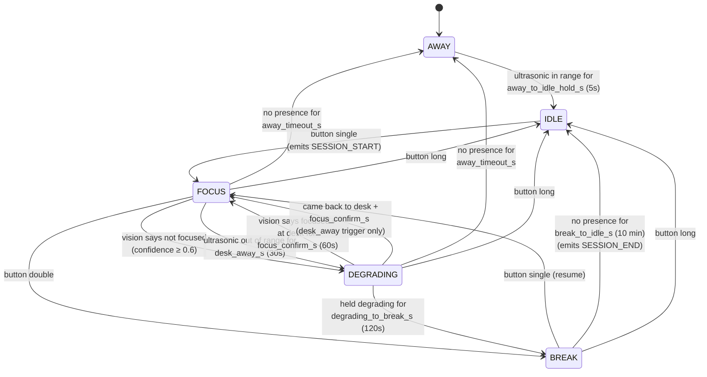
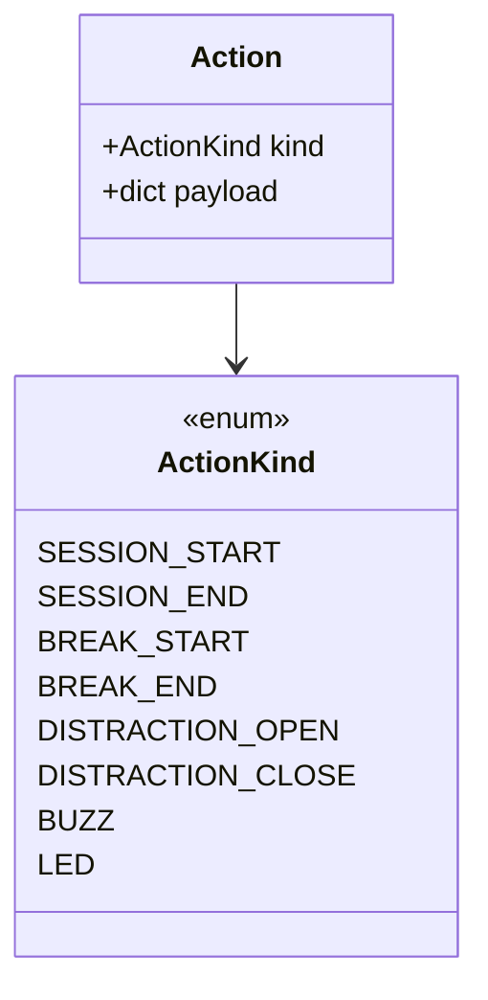

# Finite state machine

The FSM lives in [`pi/fsm.py`](../pi/fsm.py). It's a pure-logic object — no
I/O, no threads, no globals. The orchestrator pushes sensor frames, vision
judgments, button events, and 1 Hz ticks in; the FSM pushes `Action` records
out. The orchestrator then applies the actions (write to DB, buzz Arduino,
drive LEDs, etc.).

## 1. States

| State       | Meaning                                                    | LED          |
|-------------|------------------------------------------------------------|--------------|
| `AWAY`      | No one at the desk for `AWAY_TIMEOUT_S` (default 5 min).   | off          |
| `IDLE`      | Person is here, no active session.                         | yellow solid |
| `FOCUS`     | Active session, person looks focused.                      | green solid  |
| `DEGRADING` | Active session, but distracted (vision or desk-away).      | red solid    |
| `BREAK`     | User-requested break, or DEGRADING held too long.          | yellow blink |

## 2. State diagram



## 3. Actions emitted



Each Action is consumed by `Orchestrator._apply_action` and turned into a
side effect: SQL row, serial command, LED change, etc.

## 4. Hysteresis and debouncing

Every transition that could flap is guarded:

| Edge                                | Hold time          | Why                                                |
|-------------------------------------|--------------------|----------------------------------------------------|
| `AWAY → IDLE`                       | `5s`               | Don't promote on a brief PIR blip.                 |
| `FOCUS → DEGRADING` via ultrasonic  | `30s`              | Brief lean-back must not break focus.              |
| `DEGRADING → FOCUS`                 | `60s` continuous   | One frame of "focused" is not enough.              |
| `DEGRADING → BREAK`                 | `120s`             | Long distractions become breaks (kind reframe).    |
| `*` → `AWAY`                        | `300s`             | Step away to grab water without losing the session.|
| `BREAK → IDLE`                      | `600s no presence` | Break with nobody there for 10 min ends session.   |

Confidence floor for vision is `0.6`. Anything below is dropped.

## 5. Vision recovery rule

When DEGRADING was triggered by vision (`vision_not_focused`), the FSM
requires vision-confirmed recovery — sitting still alone won't credit time.
When DEGRADING was triggered by ultrasonic (`desk_away`), returning to the
desk for `focus_confirm_s` is enough. This is enforced by the
`_degrading_trigger` field and the desk-return path in `tick()`.

## 6. Counter accumulation

`tick()` accumulates `total_seconds` and (only when `state == FOCUS`)
`focused_seconds`. The clock is `time.monotonic` so an NTP adjustment can't
rewind it. Tests inject a `FakeClock`.

## 7. Tests

`pi/test_fsm.py` covers every edge above with `FakeClock`:

- `test_away_to_idle_requires_hold`
- `test_button_starts_session`
- `test_vision_distraction_then_recovery`
- `test_low_confidence_vision_ignored`
- `test_double_press_triggers_break`
- `test_break_count_increments_per_break`
- `test_long_press_ends_session`
- `test_desk_away_triggers_degrading`
- `test_null_distance_treated_as_away_from_desk`
- `test_desk_return_recovers_from_degrading`
- `test_desk_return_does_not_recover_vision_triggered_degrading`
- `test_desk_return_recovery_cancels_if_user_leaves_again`
- `test_degrading_to_break_on_timeout`

Run from `pi/`:

```bash
python -m unittest test_fsm.py
```
